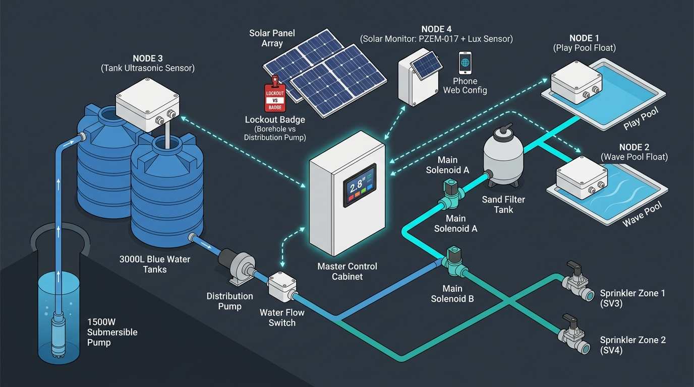

# สถาปัตยกรรมระบบควบคุมน้ำอัตโนมัติ (System Architecture Blueprint)



## 1. ภาพรวมระบบ (System Architecture Diagram)

```mermaid
graph TD
    subgraph "Outdoor Sensor Nodes (ESP-NOW Wireless Network)"
        N1["Node 1 (สระคลื่น)<br/>ESP32 + Float Switch<br/>(1 ระดับ + Debounce & Top-up Delay)"]
        N2["Node 2 (สระเล่น)<br/>ESP32 + Float Switch<br/>(1 ระดับ + Debounce & Top-up Delay)"]
        N3["Node 3 (แทงค์พักน้ำ 3,000L x 2)<br/>ESP32 + JSN-SR04T (Ultrasonic %)<br/>+ สวิตช์ลูกลอย (Hardware Backup / Overflow)"]
        N4["Node 4 (Solar Monitor - แผงโซล่าเซลล์)<br/>ESP32 + PZEM-017 (DC 0-300V/Modbus) + LDR<br/>(วัด Volt DC, Current, Power W, Light %)"]
    end

    subgraph "Master Control Panel (Headless ESP32 + Terminal Shield + Web UI Only)"
        Master["ESP32 Master Controller (ESP-WROOM-32)<br/>- ไม่มีหน้าจอแสดงผล (Headless)<br/>- ควบคุมและตั้งค่าผ่าน Web UI Dashboard 100%<br/>- ESP-NOW Receiver (4 Nodes)<br/>- Strict Mutual Exclusive Pump Manager<br/>- Fail-safe, Flow & Solar Watchdog"]
        
        RelayBoard["8-Channel Relay Module 5V (Active HIGH)<br/>(บอร์ดแยก Optocoupler พร้อม Jumper Select)"]
    end

    subgraph "Solar Power & Pump Control System (แผงโซล่าเซลล์ร่วมกัน)"
        SolarArray["Solar Panel Array (แผงโซล่าเซลล์ร่วม)"]
        
        BoreholeInverter["Inverter/Drive ปั๊มบาดาล<br/>(สั่งงานผ่านช่อง Float Switch / Dry Contact)"]
        PumpBorehole["ปั๊มบาดาล 1,500W"]
        
        RF433Remote["บอร์ดรีโมท RF433 + Reed Switch Relay<br/>(จำลองการกดรีโมท Start/Stop)"]
        FilterDrive["Drive/Inverter ปั๊มดันกรอง"]
        PumpFilter["ปั๊มดันกรองน้ำ (Main Distribution Pump)"]
        
        PSU24V["Power Supply 24V DC"]
        FlowSwitch["Water Flow Switch (สวิตช์ตรวจจับน้ำไหล)<br/>(ติดตั้งที่ท่อเมนหลักหลังปั๊มดันน้ำ)"]
        
        %% Main Selector Valves (สลับทิศทางน้ำหลัก)
        SVM_Filter["Solenoid Main A: เปิดเข้าเครื่องกรอง (สระน้ำ)"]
        SVM_Garden["Solenoid Main B: เปิดเข้ารดน้ำต้นไม้ (Bypass ถังกรอง)"]
        
        FilterUnit["ระบบถังกรองทราย / เครื่องกรองน้ำ"]
        
        %% Zone Distribution Valves (สลับโซนปลายทาง)
        SV1["Solenoid 1: สระคลื่น (24V)"]
        SV2["Solenoid 2: สระเล่น (24V)"]
        SV3["Solenoid 3: สปริงเกลอร์ โซน 1 (24V)"]
        SV4["Solenoid 4: สปริงเกลอร์ โซน 2 (24V)"]
    end

    N1 & N2 & N3 & N4 -->|ESP-NOW Data Payload ทุก 30-60s| Master

    Master -->|สัญญาณคุม 5V Active HIGH| RelayBoard
    FlowSwitch -->|Flow Status Signal (GPIO 34)| Master

    RelayBoard -->|CH1: Dry Contact คุมช่องลูกลอย| BoreholeInverter --> PumpBorehole
    RelayBoard -->|CH2: Reed Switch Pulse สั่งเปิด (ON)| RF433Remote -.->|RF ON 433MHz| FilterDrive --> PumpFilter
    RelayBoard -->|CH3: Reed Switch Pulse สั่งปิด (OFF)| RF433Remote -.->|RF OFF 433MHz| FilterDrive --> PumpFilter
    RelayBoard -->|CH4: 24V Valve Switch| SVM_Filter
    RelayBoard -->|CH5: 24V Valve Switch| SVM_Garden
    RelayBoard -->|CH6: 24V Valve Switch| SV1
    RelayBoard -->|CH7: 24V Valve Switch| SV2
    RelayBoard -->|CH8: 24V Valve Switch| SV3 & SV4

    SolarArray --> BoreholeInverter
    SolarArray --> FilterDrive
    SolarArray -.->|ต่อสายไฟแผงวัดโวลต์| N4

    %% เส้นทางการไหลของน้ำ (Hydraulic Flow)
    PumpBorehole ==>|สูบน้ำบาดาล| N3
    N3 ==>|น้ำจากแทงค์พักน้ำ| PumpFilter ==> FlowSwitch
    
    %% ทางแยกหลัก 2 ทิศทางหลังผ่าน Flow Switch
    FlowSwitch -->|โหมดเติม/กรองสระ| SVM_Filter ==> FilterUnit
    FilterUnit -->|แยกท่อสระ 1| SV1 ==> WavePool["🌊 สระคลื่น"]
    FilterUnit -->|แยกท่อสระ 2| SV2 ==> PlayPool["🏊 สระเล่น"]

    FlowSwitch -->|โหมดรดน้ำต้นไม้ Bypass กรอง| SVM_Garden
    SVM_Garden -->|แยกท่อรดน้ำ 1| SV3 ==> Sprinkler1["🌱 สปริงเกลอร์ 1"]
    SVM_Garden -->|แยกท่อรดน้ำ 2| SV4 ==> Sprinkler2["🌱 สปริงเกลอร์ 2"]
```

---

## 2. โครงสร้างการเชื่อมต่อฮาร์ดแวร์ (Hardware Interfaces)

### A. เซนเซอร์โหนด (Sensor Nodes - 4 โหนดไร้สายผ่าน ESP-NOW)
* **Node 1 (สระคลื่น)**: ESP32 + สวิตช์ลูกลอยสแตนเลส (Magnetic Float Switch) + วงจร Solar 5V/TP4056/18650
* **Node 2 (สระเล่น)**: ESP32 + สวิตช์ลูกลอยสแตนเลส (Magnetic Float Switch) + วงจร Solar 5V/TP4056/18650
* **Node 3 (แทงค์พักน้ำ 3,000L x 2 - ระบบเซ็นเซอร์คู่ Dual Level Sensor)**:
  * **ESP32 + โมดูล JSN-SR04T-V3.0 (Ultrasonic กันน้ำ)**:
    * ติดตั้งยิงจากฝาถังลงหาผิวน้ำ เพื่ออ่านระยะทาง ($cm$) แล้วแปลงเป็นปริมาตรน้ำ **0 – 100%**
    * ขาเชื่อมต่อ: `VCC -> 5V`, `GND -> GND`, `Trig -> GPIO 5`, `Echo -> GPIO 18`
  * **สวิตช์ลูกลอย (Magnetic Float Switch - Hardware Backup / Overflow Protection)**:
    * ติดตั้งที่ระดับสูงสุด (หรือระดับต่ำสุดวิกฤต) ต่อเข้า `GPIO 19` (Pull-up ภายใน)
    * ทำงานเป็นฮาร์ดแวร์ Fail-Safe: หาก Ultrasonic มีปัญหา/อ่านค่าผิดพลาด หรือระดับน้ำแตะลูกลอย ระบบจะตัดปั๊มบาดาลทันทีเพื่อกันน้ำล้น
  * **ESP-NOW Data Payload**:
    ```cpp
    struct TankNodePayload {
      uint8_t nodeId = 3;
      float waterLevelPercent; // 0.0 - 100.0%
      float distanceCm;        // ระยะทางจริง
      bool floatBackupActive;  // สถานะลูกลอยแบ็กอัป (True = แตะระดับตัด)
      float batteryVolt;       // แรงดันแบตเตอรี่โหนด
    };
    ```
* **Node 4 (Solar Monitor & Irradiance Analyzer Node)**: 
  * ติดตั้งไว้ที่จุดแผงโซล่าเซลล์/ตู้รวมสายแผง
  * **ฮาร์ดแวร์**: ESP32 + โมดูล **PZEM-017 (DC 0–300V, RS485 Modbus RTU)** + **LDR / BH1750 Light Sensor**
  * **การคำนวณภายในโหนด (Solar Irradiance Correlation Engine)**:
    * แปลงค่าเซนเซอร์แสงเป็นหน่วยความสว่างสัมพัทธ์ **Lux / Irradiance Index (%)**
    * นำค่า **Lux** ไปคำนวณเปรียบเทียบกับ **แรงดันแผงจริง ($V_{DC}$)** และ **กำลังวัตต์จริง (Power W)** เพื่อวิเคราะห์ประสิทธิภาพแสง
  * **โหมด Web UI เฉพาะของ Node 4**:
    * มี Web Server ในตัว สำหรับ Calibrate และปรับแต่งค่า
  * **การส่งข้อมูล**: ส่งข้อมูลแบบ ESP-NOW Data Struct (Volt, Current, Watt, Lux, Solar Quality Score %) แบบ Broadcast (`FF:FF:FF:FF:FF:FF`) เข้า Master Controller ทุก 15–30 วินาที

> [!NOTE]
> **การสื่อสารไร้สาย ESP-NOW**: ทุก Sensor Node จะส่งข้อมูลในโหมด **Broadcast (`FF:FF:FF:FF:FF:FF`)** ทำให้ไม่ต้องระบุหรือฟิกซ์ MAC Address ของ Master Controller โดย Master จะคัดแยกข้อมูลจาก `nodeId` ใน Struct อัตโนมัติ

---

### B. Master Controller (ESP32 30-Pin + Terminal Expansion Shield + Relay 8-CH)

ชุดควบคุมหลักใช้บอร์ด **ESP32 NodeMCU-32S** เสียบร่วมกับ **Screw Terminal Expansion Board** เพื่อการขันสายที่แน่นหนา ทำงานในรูปแบบ **Headless (ไม่มีจอภาพ)** โดยเชื่อมต่อควบคุมผ่าน **Web UI (Wi-Fi AP / STA)** เท่านั้น

#### 1) พอร์ตเอาต์พุต (8 Channels Relay Board - 5V Active HIGH):
*ใช้บอร์ด Relay 8-Channel สีแดงแบบมี Optocoupler Isolated และตั้ง Jumper แต่ละช่องไว้ที่ตำแหน่ง **High** (Active HIGH Trigger: ส่ง Logic HIGH = Relay ทำงาน)*

| CH | ชื่อเอาต์พุต (Output Target) | ขา GPIO บน ESP32 | ลักษณะสัญญาณ / อุปกรณ์ที่ควบคุม |
| :--- | :--- | :--- | :--- |
| **CH1** | **ปั๊มบาดาล 1,500W** | `GPIO 23` | Dry Contact (NO/COM) ต่อเข้าขั้วสวิตช์ลูกลอย Inverter บาดาล |
| **CH2** | **ปั๊มดันน้ำ (สั่งเปิด ON)** | `GPIO 22` | Pulse สั้น (400ms) ต่อผ่าน Reed Switch Relay เข้าปุ่ม ON รีโมท RF433 |
| **CH3** | **ปั๊มดันน้ำ (สั่งปิด OFF)** | `GPIO 21` | Pulse สั้น (400ms) ต่อผ่าน Reed Switch Relay เข้าปุ่ม OFF รีโมท RF433 |
| **CH4** | **Solenoid Main A (เข้ากรองสระ)** | `GPIO 19` | คุมไฟ 24V DC (เปิดเมื่อจ่ายน้ำเข้าสระคลื่น/สระเล่น) |
| **CH5** | **Solenoid Main B (Bypass รดน้ำ)** | `GPIO 18` | คุมไฟ 24V DC (เปิดเมื่อรดน้ำต้นไม้) |
| **CH6** | **Solenoid SV1 (สระคลื่น)** | `GPIO 5` | คุมไฟ 24V DC (เปิดจ่ายน้ำเข้าสระคลื่น) |
| **CH7** | **Solenoid SV2 (สระเล่น)** | `GPIO 17` | คุมไฟ 24V DC (เปิดจ่ายน้ำเข้าสระเล่น) |
| **CH8** | **Solenoid SV3/SV4 (สปริงเกลอร์)** | `GPIO 16` | คุมไฟ 24V DC (เปิดจ่ายน้ำเข้าระบบสปริงเกลอร์รดน้ำ) |

> [!NOTE]
> การเลือกใช้ขา GPIO ข้างต้นเลือกเฉพาะขาที่เป็น Safe Output Pins ไม่ติดขัดการ Boot (หลีกเลี่ยง GPIO 0, 2, 12, 15) ทำให้เมื่อเปิดเครื่องหรือรีบูต รีเลย์จะไม่กระตุกเปิด-ปิดเอง

#### 2) พอร์ตอินพุตเซนเซอร์ (Input Sensor):
| เซนเซอร์ | ขา GPIO บน ESP32 | รายละเอียดการต่อวงจร |
| :--- | :--- | :--- |
| **Water Flow Switch** | `GPIO 34` (Input Only) | สวิตช์ตรวจจับน้ำไหลที่ท่อเมนหลักหลังปั๊ม (ต่อ Pull-up Resistor 10k $\Omega$ เข้ากับ 3.3V) |

#### 3) ชุดแสดงผลหน้ากล่องควบคุม (Minimal Front Panel Indicators & Alarm Buzzer):
ออกแบบให้ติดตั้งง่าย สวยงาม มินิมอล ใช้หลอด Pilot Lamp / LED โลหะ 2 ดวง (SYS & ERR) + 1 Active Buzzer:

| อุปกรณ์หน้าตู้ | สี / ชนิด | ขา GPIO บน ESP32 | พฤติกรรมสัญญาณและรูปแบบการแจ้งเตือน (Blink & Beep Pattern) |
| :--- | :--- | :--- | :--- |
| **SYS_LED** | 🟢 เขียว / ฟ้า | `GPIO 25` | • **ติดค้าง**: ระบบปกติ สแตนด์บายพร้อมทำงาน (Idle)<br/>• **กะพริบ Heartbeat ช้าๆ**: ระบบกำลังทำงานสูบน้ำ/จ่ายน้ำ (Running) |
| **ERR_LED** | 🔴 แดง | `GPIO 33` | กะพริบตามจำนวนครั้ง **(Blink Count Codes)** วนซ้ำทุกๆ 2 วินาที เพื่อระบุ Error ชัดเจน (ดูตาราง Error Codes ด้านล่าง) |
| **BUZZER** | 🔊 Active Buzzer | `GPIO 32` | • **Beep สั้น 1 ครั้ง (100ms)**: เริ่มงาน หรือ สลับสถานะงาน<br/>• **Beep ถี่ 3 ครั้ง (Beep-Beep-Beep)**: เกิด Alarm Error / Safety Lockout<br/>• **ปิดเสียงอัตโนมัติ**: ส่งเสียงเตือนเฉพาะตอนเกิดเหตุ ไม่ร้องแช่ต่อเนื่อง |

##### 🔴 ตารางรหัสกะพริบแจ้งเตือนความผิดปกติ (ERR_LED Blink Count Codes):
*ระบบจะกะพริบไฟสีแดงตามจำนวนครั้งที่กำหนด แล้วหยุดเว้นวรรค 2 วินาที ก่อนวนซ้ำรอบถัดไป:*

| จำนวนครั้งที่กะพริบ | ชื่อรหัส Error (Alarm Code) | สาเหตุและเงื่อนไข (Trigger Condition) | การแก้ไข / พฤติกรรมระบบ |
| :---: | :--- | :--- | :--- |
| **1 ครั้ง**<br/>(💡 ➔ เว้น 2s) | **No Flow Error (E1)** | สั่งเปิดปั๊มดันน้ำแล้ว Flow Switch ไม่ติดภายในเวลา Timeout ที่ตั้งไว้ | ปั๊มตัดทันที ปิดวาล์วทั้งหมด เข้า Safety Lockout |
| **2 ครั้ง**<br/>(💡💡 ➔ เว้น 2s) | **Tank Dry-Run / Low (E2)** | ระดับน้ำแทงค์ต่ำกว่าเกณฑ์ปลอดภัย ($\le 25\%$) | ระงับปั๊มดันน้ำและสปริงเกลอร์ทั้งหมด รอเติมน้ำ |
| **3 ครั้ง**<br/>(💡💡💡 ➔ เว้น 2s) | **Sensor Node Lost (E3)** | ขาดสัญญาณ ESP-NOW จาก Node ใดๆ เกิน 3 นาที | ระงับคำสั่งงานเฉพาะโซนนั้น และเตือน Node Offline |
| **4 ครั้ง**<br/>(💡💡💡💡 ➔ เว้น 2s) | **Low Solar / Solar Cutoff (E4)** | แดดตก โวลต์แผง $V_{DC} < \text{Threshold}$ ขณะทำงาน | เข้าสู่สถานะ PAUSE ชะลอการทำงานอัตโนมัติ |
| **ติดค้างถาวร**<br/>(Solid ON) | **Emergency Stop (E-STOP)** | มีการกดปุ่ม E-Stop ผ่าน Web UI หรือระบบ Lockout ขั้นวิกฤต | ตัดไฟทุกเอาต์พุต ต้องปลดล็อคผ่าน Web UI เท่านั้น |

> [!TIP]
> * **การต่อวงจร LED**: ขา GPIO ต่อผ่านตัวต้านทาน Drop แรงดัน $330\ \Omega$ เข้าขา Anode (+) ของ LED และต่อขา Cathode (-) ลง GND
> * **การต่อวงจร Buzzer**: ขา `GPIO 32` ขับผ่านวงจรทรานซิสเตอร์ NPN (เช่น S8050 / 2N2222) เพื่อเสียงเตือนที่ดังชัดเจนและไม่ดึงกระแสจากขา ESP32 โดยตรง

---

## 3. ลอจิกการทำงานและเงื่อนไขความปลอดภัย (Control Logic & Strict Interlocks)

### 1) กฎเหล็กด้านความปลอดภัย (Strict Mutual Exclusive Interlocks)
* **กฎข้อที่ 1 (ปั๊มทำงานทีละตัว)**: **ห้ามเปิดปั๊มบาดาลและปั๊มดันน้ำพร้อมกันเด็ดขาด** (แชร์แผงโซล่าเซลล์)
* **กฎข้อที่ 2 (แยกเส้นทางน้ำเด็ดขาด - Main Valve Isolation)**: 
  * เมื่อรดน้ำต้นไม้: **เปิด Main B (รดน้ำ) และ ปิด Main A (เข้ากรอง) เด็ดขาด**
  * เมื่อเติมน้ำสระ: **เปิด Main A (เข้ากรอง) และ ปิด Main B (รดน้ำ) เด็ดขาด**
* **กฎข้อที่ 3 (โซนปลายทางทำงานทีละตัว - Single Zone Rule)**: วาล์วปลายทาง (สระคลื่น, สระเล่น, สปริงเกลอร์) เปิดทำงานได้ทีละ 1 โซนเท่านั้น ห้ามเปิดพร้อมกัน
* **กฎข้อที่ 4 (No-Flow Safety Protection - ป้องกันวาล์วไม่เปิด/ปั๊มไหม้)**:
  * ทุกครั้งที่สั่งเปิดปั๊มดันน้ำ (`RF433 ON`) ระบบจะเริ่มนับเวลา **Flow Confirmation Timeout (ปรับตั้งเวลาได้เอง 3 – 30 วินาที, ค่าเริ่มต้น 8 วินาที)**
  * หากพ้นเวลาที่กำหนดแล้ว **Water Flow Switch ยังไม่ส่งสัญญาณว่ามีน้ำไหล (Flow Switch = Open)**:
    1. สั่งตัดปั๊มดันน้ำทันที (`RF433 OFF`)
    2. ปิด Solenoid ทั้งหมดทันที
    3. ส่งสัญญาณเตือน **ERROR: No Flow Detected (Valve Stuck / Dry Run)** บน Web UI Dashboard
    4. เข้าสู่สถานะ **Safety Lockout** (ไม่อนุญาตให้เปิดปั๊มซ้ำอัตโนมัติจนกว่าจะกด Reset หรือตรวจสอบระบบ)
* **Dead-time Switching Sequence**:
  $$\text{หยุดปั๊ม} \longrightarrow \text{ปิดวาล์วเดิมทั้งหมด} \longrightarrow \text{หน่วง Dead-time 5–10s} \longrightarrow \text{เปิด Main Valve + Zone Valve ใหม่} \longrightarrow \text{หน่วง 2s} \longrightarrow \text{สตาร์ตปั๊ม} \longrightarrow \text{ตรวจ Flow Switch ภายใน Timeout ที่ตั้งไว้}$$

---

### 2) ระบบบริหารพลังงานแสงอาทิตย์ (Solar & Daylight Power Management)

เนื่องจากปั๊มทั้งสองตัวขับเคลื่อนด้วยพลังงานจากแผงโซล่าเซลล์โดยตรง ระบบจึงมีระบบประเมินพลังงานก่อนสั่งงาน:

1. **เงื่อนไขพร้อมใช้งานพลังงานแสงอาทิตย์ (Solar Ready Conditions)**:
   * **Solar Window**: กำหนดช่วงเวลาที่มีแสงแดด (เช่น 08:30 – 16:30 น.)
   * **Solar Voltage Threshold**: แรงดันแผง $V_{DC} \ge \text{Min Threshold}$ (เช่น ตั้งไว้ $\ge 120V_{DC}$ ปรับได้ 50–200V)
   * **Sunlight Intensity**: ค่าความเข้มแสงจาก LDR ผ่านเกณฑ์ขั้นต่ำ (ไม่มืดครึ้มฝนตกหนัก)

2. **พฤติกรรมเมื่อแดดหุบ / เมฆบังชั่วคราวระหว่างวัน (Daytime Low Solar Pause & Auto-Resume)**:
   * หากปั๊มกำลังทำงานแล้วแดดอ่อนลงจน Flow Switch หลุด หรือโวลต์แผงตกต่ำกว่าเกณฑ์:
     * สั่ง **หยุดปั๊มทันที (RF433 OFF / ตัดบาดาล)** และปิดวาล์ว
     * ระบบจะเข้าสู่สถานะ **PAUSE (รอแดด)** โดยยังคงจำคิวงานและเวลาที่เหลือไว้
     * เมื่อแดดกลับมาสม่ำเสมอติดต่อกันเกิน 1–2 นาที ➔ ระบบจะ **เริ่มงานต่ออัตโนมัติ (Auto-Resume)**

3. **พฤติกรรมช่วงค่ำ / กลางคืน (Night Reset & Standby)**:
   * เมื่อเข้าสู่ช่วงพลบค่ำ (พ้น Solar Window หรือโวลต์แผง $V_{DC} < 50V$ ต่อเนื่อง):
     * **ไม่อนุญาตให้ปั๊มใดๆ ทำงานเด็ดขาด** (ปิดวาล์วทั้งหมด)
     * **เคลียร์และรีเซ็ตคิวงานประจำวัน (Daily Reset)**: ยกเลิกงานค้าง เพื่อเตรียมพร้อมรอรับคำขอใหม่และรอรอบ Schedule รดน้ำของวันรุ่งขึ้น

---

### 3) ลำดับความสำคัญและลอจิกการขัดจังหวะ (Priority & Interruption Logic)

ระบบใช้ลอจิก **"Hard Preemption เฉพาะบาดาล (Priority 0) + Cooperative Non-preemption สำหรับฝั่งจ่ายน้ำ (Priority 1, 2, 3)"**:

| ลำดับ Priority | กิจกรรม / โซน | สิทธิ์การขัดจังหวะ (Preemption Right) | พฤติกรรมเมื่อถูกขัดจังหวะ |
| :--- | :--- | :--- | :--- |
| **Priority 0 (สูงสุด)** | **ปั๊มบาดาลเติมแทงค์** | **ขัดจังหวะได้ทุกงานทันที (Hard Preempt)** | - (เป็นผู้ขัดจังหวะหลัก) |
| **Priority 1** | **สปริงเกลอร์** | ขัดจังหวะสระไม่ได้ (รอสระทำเสร็จก่อน) แต่รันก่อนถ้าไม่มีใครทำ | ถูกบาดาลหยุดชั่วคราว ➔ **จำเวลาที่เหลือ ➔ ทำต่อจนครบ (Resume)** |
| **Priority 2** | 🏊 **สระเล่น** | ขัดจังหวะสระคลื่นไม่ได้ (รอสระคลื่นเสร็จ) | ถูกบาดาลขัดจังหวะได้ ➔ เมื่อแทงค์เต็มจึงกลับมาเติมต่อ |
| **Priority 3** | 🌊 **สระคลื่น** | ไม่สามารถขัดจังหวะใครได้ | ถูกบาดาลขัดจังหวะได้ ➔ เมื่อแทงค์เต็มจึงกลับมาเติมต่อ |

---

### 4) การป้องกัน Fail-Safe และ Watchdog
* **Tank Dual Sensor Safety (Node 3)**:
  * หากระดับน้ำจาก Ultrasonic ต่ำกว่าเกณฑ์ปลอดภัย (`<= 25%`) หรือสวิตช์ลูกลอยตรวจพบระดับแห้ง ➔ **Lockout ปั๊มกรองและสปริงเกลอร์ทันที**
  * หากสวิตช์ลูกลอยระดับสูงถูกยกตัว (Float Switch Active) ➔ **ตัดปั๊มบาดาลทันที** แม้ค่า Ultrasonic จะยังไม่ถึง 100% ก็ตาม (ป้องกันน้ำล้น)
* **Node Lost Watchdog (3 นาที)**: หากขาดสัญญาณจาก Node ใดเกิน 3 นาที ระบบจะตัดการจ่ายน้ำของโซนนั้นทันทีและแสดงสถานะ Warning บน Web UI

---

## 4. สถาปัตยกรรมระบบควบคุมผ่าน Web UI Dashboard (Web-Only Control System)

เนื่องจากชุด Master เป็นแบบไม่มีจอภาพ (Headless) การบริหารจัดการทั้งหมดจึงทำผ่าน **Local Responsive Web Dashboard**:

1. **โหมดการเชื่อมต่อเครือข่าย (Dual Wi-Fi Mode)**:
   * **AP Mode (Default)**: ปล่อย Wi-Fi Hotspot ชื่อ `SmartWater-Master` (IP: `192.168.4.1`) สำหรับเชื่อมต่อผ่านมือถือโดยตรง
   * **Station Mode (STA)**: เกาะ Wi-Fi บ้าน/หน้างาน ทำให้สามารถเข้าผ่าน IP วงเดียวกันได้
   * รองรับระบบ **mDNS** (`http://smartwater.local`) เพื่อความสะดวกในการเข้าใช้งาน

2. **Real-Time Web Dashboard Features**:
   * **Tank Water Level Gauges**: แสดงมาตรวัดระดับน้ำแทงค์แบบ Animated Visual Gauge (คำนวณจาก Ultrasonic JSN-SR04T) พร้อมไอคอนเตือนสถานะ Float Switch Backup
   * **Node Health & Telemetry**: แสดงสถานะ Online/Offline, ค่าความแรงสัญญาณ RSSI, ระดับแบตเตอรี่ (V) และค่าเซนเซอร์ของแต่ละ Node
   * **Live Pump & Valve Mimic Diagram**: แสดงสถานะเปิด-ปิดของปั๊มบาดาล, ปั๊มดันน้ำ, Solenoid Main A/B และ Solenoid ปลายทาง พร้อมกราฟิกน้ำไหล
   * **Manual Control & Override**:
     * ปุ่ม Manual Start/Stop ปั๊มบาดาล (พร้อม Interlock Safety)
     * ปุ่มเลือกรดน้ำ / เติมสระ พร้อมระบบตั้งเวลาปิดอัตโนมัติ (Timer Run)
     * ปุ่ม **EMERGENCY STOP (E-STOP)** สำหรับตัดไฟทุกโหลดทันที
   * **Configuration Panel**:
     * ปรับแต่งค่า Threshold ระดับน้ำแทงค์ (Low Trigger %, High Stop %)
     * ปรับแต่งค่า Solar Cutoff, ช่วงเวลา Solar Window, Flow Timeout
     * กำหนดตารางเวลารดน้ำต้นไม้ (Sprinkler Timer Schedule)
     * บันทึกค่าลงใน **ESP32 NVS (Non-Volatile Storage)** อัตโนมัติ ไฟดับค่าไม่หาย

